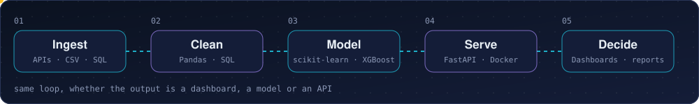
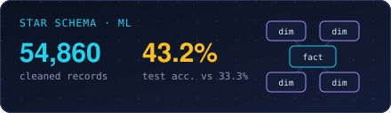
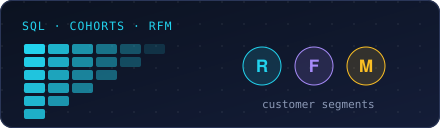
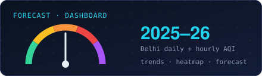
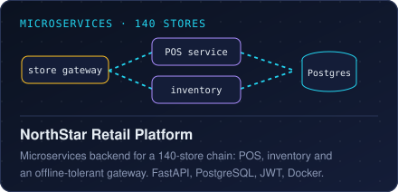
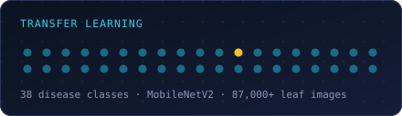
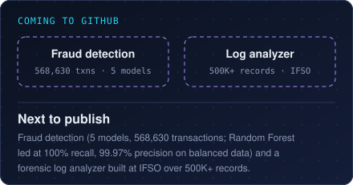
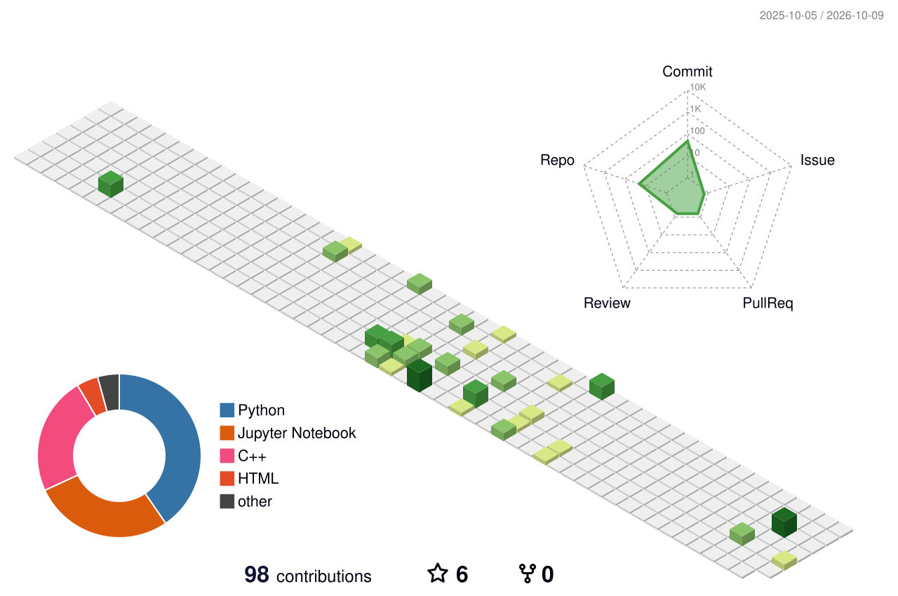

<p align="center">
  <picture>
    <source media="(max-width: 600px)" srcset="assets/banner-mobile.svg"/>
    
  </picture>
</p>

<p align="center">
  <a href="mailto:snehajuyal20@gmail.com"></a>
  <a href="https://linkedin.com/in/sneha-juyal"></a>
  
</p>

```python
class Sneha:
    studying = "B.Tech ECE, AI/ML minor"
    college  = "MSIT, GGSIPU, Delhi"
    toolkit  = ["Python", "SQL", "Excel",
                "scikit-learn", "FastAPI"]
    interned = ["Business analysis, Crazibrain",
                "Data + software, IFSO Delhi Police"]
    open_to  = ["Software", "Data", "ML / AI",
                "Business analysis"]

    def next_up(self):
        return "ship the fraud + log-analyzer repos"
```

<br/>

### How I work

<p align="center">
  <picture>
    <source media="(max-width: 600px)" srcset="assets/pipeline-mobile.svg"/>
    
  </picture>
</p>

<br/>

### Things I've built

<p align="center">
  <a href="https://github.com/SNEHAJUYAL/Healthcare-Intelligence-Platform"></a>
  <a href="https://github.com/SNEHAJUYAL/Sales"></a>
  <a href="https://github.com/SNEHAJUYAL/AQI-index-"></a>
  <a href="https://github.com/SNEHAJUYAL/Centific_Northstarplatform"></a>
  <a href="https://github.com/SNEHAJUYAL/PlantCare-AI-Advanced-Plant-Disease-Detection-Using-Transfer-Learning"></a>
  
</p>

<br/>

### Toolkit

| Area | Tools | Used for |
|---|---|---|
| Data and analytics | Python, SQL, Excel, Pandas, NumPy, Tableau, Matplotlib, Seaborn | Cleaning, EDA, KPI reconciliation, dashboards |
| Machine learning | scikit-learn, XGBoost | Feature engineering, model comparison, evaluation |
| Software and backend | Python, FastAPI, PostgreSQL, Docker, Git, C++ | REST services, auth, containerised services |
| Cloud | AWS, Azure | Currently learning managed storage and data pipelines |

<br/>

### Where I've worked

**Business Analyst Intern**, Crazibrain Solutions Pvt. Ltd. · *Jul 2026 – Present*<br/>
Wrote BRDs/FRDs and user stories for a nutrition-monitoring platform (registration, attendance, monitoring); ran
functional, system and UAT testing across the app, APIs and admin portal; validated dashboard KPIs through data reconciliation.

**Software Development & Data Analysis Intern**, IFSO, Delhi Police (NCFL) · *May 2025 – Jul 2025*<br/>
Analysed patterns across 500K+ digital records with a custom log analyzer; built a Python tool that parses large
blockchain `.dat` files into structured tables; compared Claude, Gemini and Kiro against ChatGPT for investigative use cases.

<br/>

### Leading things

- **Co-Head, Placement Coordinator**, MSIT Training & Placement Cell: placement operations for 350–400+ students
- **Chief Organiser**, AVENSIS / HackAVENSIS: 24-hour national hackathon, 1,253+ registrations, 45 finalist teams
- **Vice President**, IEEE MSIT: coordinates 4 affinity chapters and 200+ members
- **Treasurer**, IEEE WIE MSIT: chapter finances and the STAR programme; IEEE Delhi Section Student Volunteer Award 2025
- **Advisor** (previously Vice President), IIC MSIT: leads SIH and YUKTI participation
- **Finalist**, Microsoft TechJam · **Published**, NCI TIDE 2025: social media forensic extractor, 2,000+ participants
- **Finalist**, HackSmart with BatterySmart: SachAI, a tool that flags likely hallucinations in AI-generated answers

<br/>

### Activity

<p align="center">
  
</p>

<p align="center">
  <picture>
    <source media="(prefers-color-scheme: dark)" srcset="profile-3d-contrib/profile-night-rainbow.svg"/>
    
  </picture>
</p>

<details>
<summary>Contribution snake</summary>
<p align="center">
  <picture>
    <source media="(prefers-color-scheme: dark)" srcset="https://raw.githubusercontent.com/SNEHAJUYAL/SNEHAJUYAL/output/github-snake-dark.svg"/>
    
  </picture>
</p>
</details>

<p align="center">
  <sub>Banner, pipeline and project art are hand-built SVGs · stats and 3D calendar are regenerated by GitHub Actions · <a href="https://shields.io">shields.io</a> · <a href="https://github.com/yoshi389111/github-profile-3d-contrib">github-profile-3d-contrib</a> · <a href="https://github.com/Platane/snk">platane/snk</a></sub>
</p>
